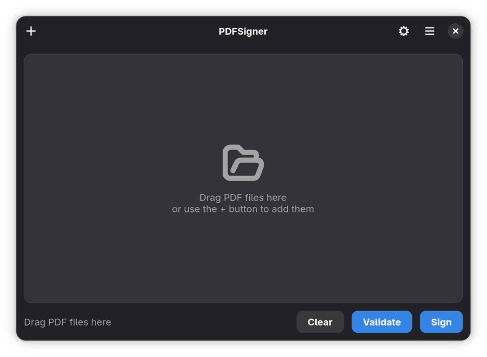
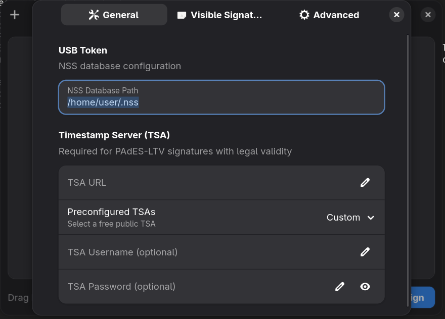
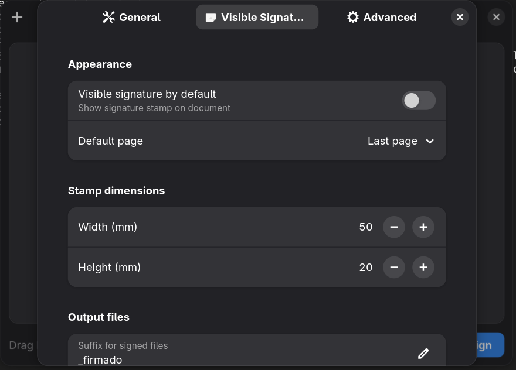
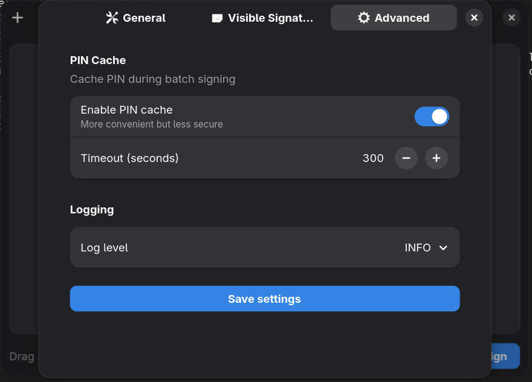

# PDFSigner

**Digital PDF Signing with USB Cryptographic Tokens**

[](https://www.python.org/downloads/)
[](https://opensource.org/licenses/MIT)
[](https://gtk.org/)

PDFSigner is a tool for digitally signing PDF documents using PKCS#11 cryptographic USB tokens with legally valid PAdES-LTV signatures.

## ✨ Features

- **PAdES-LTV Signature** - Long Term Validation with TSA timestamp
- **Multi-Token Support** - SafeNet, YubiKey, Nitrokey, OpenSC, and more via PKCS#11
- **GTK4 GUI** - Modern graphical interface with drag & drop
- **Complete CLI** - For scripts and automation
- **Dry-Run Mode** - Simulate signing without token for testing
- **Visible/invisible signature** - With smart positioning
- **QR verification code** - Optional QR code in visible signatures for verification
- **Batch signing** - Multiple PDFs with a single PIN
- **Validation** - Verify existing signatures
- **Multi-signature** - Add additional signatures to already signed PDFs

---

## 📸 Screenshots

<table>
  <tr>
    <td align="center">
      
      <br/><b>Main Window</b><br/>
      <sub>Drag & drop PDF files to sign</sub>
    </td>
    <td align="center">
      
      <br/><b>Settings - General</b><br/>
      <sub>NSS database path and TSA configuration</sub>
    </td>
  </tr>
  <tr>
    <td align="center">
      
      <br/><b>Settings - Visible Signature</b><br/>
      <sub>Signature appearance and dimensions</sub>
    </td>
    <td align="center">
      
      <br/><b>Settings - Advanced</b><br/>
      <sub>PIN cache and logging options</sub>
    </td>
  </tr>
</table>

---

## 📋 Table of Contents

1. [Screenshots](#-screenshots)
2. [Prerequisites](#-prerequisites)
3. [SafeNet Driver Installation](#-safenet-5110-driver-installation)
4. [NSS Database Creation](#️-nss-database-creation)
5. [PDFSigner Installation](#-pdfsigner-installation)
6. [Configuration](#️-configuration)
7. [Usage](#️-usage)
8. [Dry-Run Mode (Testing)](#-dry-run-mode-testing)
9. [Building & Distribution](#-building--distribution)
10. [Troubleshooting](#-troubleshooting)
11. [Development](#-development)

---

## 🔧 Prerequisites

Before installing PDFSigner, you need:

| Requirement | Description |
|-------------|-------------|
| **USB Token** | Any PKCS#11 compatible token (see supported list below) |
| **Certificate** | Digital signing certificate installed on the token |
| **Linux** | Debian 13+, Ubuntu 24.04+, Fedora 39+, Arch, openSUSE Tumbleweed |
| **Drivers** | Token-specific PKCS#11 driver |
| **NSS Database** | NSS database with registered PKCS#11 module |

### Supported Tokens

PDFSigner auto-detects PKCS#11 libraries in priority order:

| Token | Library | Use Case |
|-------|---------|----------|
| **SafeNet/Thales eToken** | `libeToken.so` | Enterprise signing (5110, 5300) |
| **Luna HSM** | `libCryptoki2_64.so` | High-security HSM |
| **YubiKey** | `libykcs11.so` | PIV mode signing |
| **Nitrokey** | `libnethsm.so` | Open-source security |
| **OpenSC** | `opensc-pkcs11.so` | Generic smart cards |
| **Feitian ePass** | `libcastle.so`, `libftsafe-p11.so` | ePass tokens |
| **SoftHSM** | `libsofthsm2.so` | Testing/development |
| **nCipher/Entrust** | `libcknfast.so` | Enterprise HSM |

### Verify your environment

```bash
# Do you have the token connected?
lsusb | grep -i "safenet\|gemalto\|thales\|yubico\|nitrokey\|feitian"

# Expected output (example):
# Bus 001 Device 003: ID 0529:0620 Aladdin Knowledge Systems Token JC
```

---

## 🔑 SafeNet 5110 Driver Installation

### Step 1: Download the driver

SafeNet (now Thales) drivers are obtained from:

1. **Option A - Official provider:** Contact your certificate provider
2. **Option B - Thales Portal:** https://supportportal.thalesgroup.com (requires account)
3. **Option C - Your organization:** The IT department usually provides the installer

The file is typically named: `SafenetAuthenticationClient-*.deb` or `SAC*.rpm`

### Step 2: Install the driver

#### Debian / Ubuntu

```bash
# If you have the .deb
sudo dpkg -i SafenetAuthenticationClient-*.deb
sudo apt-get install -f  # Resolve dependencies

# Verify installation
ls -la /usr/lib/libeToken.so
# The file should exist
```

#### Fedora / RHEL

```bash
# If you have the .rpm
sudo rpm -ivh SafenetAuthenticationClient-*.rpm

# Or with dnf
sudo dnf install ./SafenetAuthenticationClient-*.rpm

# Verify
ls -la /usr/lib64/libeToken.so
```

#### Arch Linux (AUR)

```bash
# Using yay
yay -S safenet-authentication-client

# Or manually from AUR
git clone https://aur.archlinux.org/safenet-authentication-client.git
cd safenet-authentication-client
makepkg -si
```

### Step 3: Configure USB permissions

```bash
# Create udev rule for the token
sudo tee /etc/udev/rules.d/90-safenet.rules << 'EOF'
# SafeNet eToken 5110
SUBSYSTEM=="usb", ATTR{idVendor}=="0529", MODE="0666"
# Gemalto/Thales (some models)
SUBSYSTEM=="usb", ATTR{idVendor}=="08e6", MODE="0666"
EOF

# Reload rules
sudo udevadm control --reload-rules
sudo udevadm trigger

# Disconnect and reconnect the token
```

### Step 4: Verify installed driver

```bash
# Verify that the module exists
ls -la /usr/lib/libeToken.so /usr/lib64/libeToken.so 2>/dev/null

# Verify with pkcs11-tool (from opensc)
pkcs11-tool --module /usr/lib/libeToken.so -L

# Expected output:
# Available slots:
# Slot 0 (0x0): SafeNet eToken 5110 [Main Interface] 00 00
#   token label        : Your Name
#   token manufacturer : SafeNet, Inc.
#   ...
```

---

## 🗄️ NSS Database Creation

NSS (Network Security Services) is the database that Mozilla uses for certificates. PDFSigner uses NSS to communicate with the token.

### Step 1: Install NSS tools

```bash
# Debian/Ubuntu
sudo apt install libnss3-tools

# Fedora/RHEL
sudo dnf install nss-tools

# Arch
sudo pacman -S nss

# openSUSE
sudo zypper install mozilla-nss-tools
```

### Step 2: Create NSS directory

```bash
# Create directory for the database
mkdir -p ~/.nss

# Verify it's empty
ls -la ~/.nss
```

### Step 3: Initialize NSS database

```bash
# Create NSS database (SQL format, recommended)
certutil -N -d sql:$HOME/.nss

# You'll be asked for a password for the database
# IMPORTANT: This is NOT the token password, it's to protect the local DB
# You can leave it empty for development (Enter twice)

# Verify it was created correctly
ls -la ~/.nss
# You should see: cert9.db, key4.db, pkcs11.txt
```

### Step 4: Register SafeNet module in NSS

```bash
# Add the SafeNet PKCS#11 module
# IMPORTANT: Use the correct path for your system

# For 64-bit systems with lib in /usr/lib:
modutil -add "SafeNet" -libfile /usr/lib/libeToken.so -dbdir sql:$HOME/.nss

# For systems with lib in /usr/lib64:
modutil -add "SafeNet" -libfile /usr/lib64/libeToken.so -dbdir sql:$HOME/.nss

# Verify it was added
modutil -list -dbdir sql:$HOME/.nss

# Expected output:
# Listing of PKCS #11 Modules
# -----------------------------------------------------------
#   1. NSS Internal PKCS #11 Module
#   ...
#   2. SafeNet
#        library name: /usr/lib/libeToken.so
#        ...
```

### Step 5: Verify token access

```bash
# List available slots (with token connected)
modutil -list -dbdir sql:$HOME/.nss

# List certificates on the token
# NOTE: You'll be asked for the token PIN
certutil -L -d sql:$HOME/.nss -h "SafeNet eToken 5110"

# Expected output:
# Certificate Nickname                              Trust Attributes
#                                                   SSL,S/MIME,JAR/XPI
# SafeNet eToken 5110:Your Name                     u,u,u
```

### Step 6: Verify signing certificate

```bash
# View certificate details
certutil -L -d sql:$HOME/.nss -n "SafeNet eToken 5110:Your Name"

# Verify it has signing capability (Key Usage)
# Look for: "Digital Signature" or "Non-Repudiation" in the output
```

### NSS Troubleshooting

```bash
# Error: "SEC_ERROR_BAD_DATABASE"
# Solution: Restart the database
rm -rf ~/.nss/*
certutil -N -d sql:$HOME/.nss

# Error: "SEC_ERROR_PKCS11_DEVICE_ERROR"
# Solution: The token is not connected or the driver doesn't work
pkcs11-tool --module /usr/lib/libeToken.so -L

# Error: "SEC_ERROR_TOKEN_NOT_LOGGED_IN"
# Solution: You need to provide the token PIN

# Error: Module not found
# Solution: Verify the module path
find /usr -name "libeToken.so" 2>/dev/null
```

---

## 📦 PDFSigner Installation

### Quick Installation (Recommended)

```bash
# Clone repository
git clone https://github.com/vdiriern/pdfsigner.git
cd pdfsigner

# Run automatic installer
./scripts/install.sh
```

### Manual Installation

#### Debian / Ubuntu / Linux Mint

```bash
# 1. System dependencies
sudo apt update
sudo apt install -y \
    python3-gi \
    python3-gi-cairo \
    gir1.2-gtk-4.0 \
    gir1.2-adw-1 \
    libnss3-tools \
    opensc

# 2. Install uv (Python package manager)
curl -LsSf https://astral.sh/uv/install.sh | sh
source ~/.bashrc

# 3. Clone and install
git clone https://github.com/vdiriern/pdfsigner.git
cd pdfsigner
uv sync

# 4. Configure access to system PyGObject
echo "/usr/lib/python3/dist-packages" > .venv/lib/python3.*/site-packages/system-packages.pth

# 5. Copy configuration
mkdir -p ~/.config/pdfsigner
cp config/pdfsigner.toml.example ~/.config/pdfsigner/config.toml

# 6. Edit configuration with your NSS path
nano ~/.config/pdfsigner/config.toml
# Change: nss_db_path = "/home/YOUR_USERNAME/.nss"
```

#### Fedora / RHEL 9+

```bash
# 1. Dependencies
sudo dnf install -y \
    python3-gobject \
    gtk4 \
    libadwaita \
    nss-tools \
    opensc

# 2-6. Same as Debian, but the system path is different:
echo "/usr/lib64/python3.*/site-packages" > .venv/lib/python3.*/site-packages/system-packages.pth
```

#### Arch Linux

```bash
# 1. Dependencies
sudo pacman -S --noconfirm \
    python-gobject \
    gtk4 \
    libadwaita \
    nss \
    opensc

# 2-6. Same as Debian
echo "/usr/lib/python3.*/site-packages" > .venv/lib/python3.*/site-packages/system-packages.pth
```

### Verify installation

```bash
# Verify that PDFSigner works
uv run pdfsigner --help

# Expected output:
# usage: pdfsigner [-h] [-v] [--dry-run] {sign,validate,list-certs} ...
# PDFSigner - Digital PDF signing with USB token
```

---

## ⚙️ Configuration

### Configuration file

Location: `~/.config/pdfsigner/config.toml`

```toml
# PDFSigner - Configuration
# Author: Homero Thompson del Lago del Terror

# ============================================================================
# NSS Database (USB Token)
# ============================================================================
# IMPORTANT: Change to your user directory
nss_db_path = "/home/YOUR_USERNAME/.nss"

# ============================================================================
# TSA (Timestamp Authority) - REQUIRED for legally valid signatures
# ============================================================================
# Option 1: Free TSA (for testing)
tsa_url = "https://freetsa.org/tsr"

# Option 2: Corporate TSA
# tsa_url = "https://tsa.yourcompany.com/timestamp"
# tsa_username = "username"
# tsa_password = "password"

# ============================================================================
# Visible Signature
# ============================================================================
default_visible = false          # true = show signature stamp
signature_width_mm = 50          # Stamp width
signature_height_mm = 20         # Stamp height
default_page = "last"            # "last", "first", or page number

# ============================================================================
# Output Files
# ============================================================================
output_suffix = "_signed"        # document.pdf → document_signed.pdf

# ============================================================================
# PIN Cache
# ============================================================================
pin_cache_enabled = true
pin_cache_timeout_seconds = 300  # 5 minutes

# ============================================================================
# Dry-Run Mode (for testing without token)
# ============================================================================
dry_run = false                  # true = simulate signing without real token

# ============================================================================
# Logging
# ============================================================================
log_level = "INFO"               # DEBUG, INFO, WARNING, ERROR
```

### Free Public TSAs

| Provider | URL | Usage |
|----------|-----|-------|
| FreeTSA | `https://freetsa.org/tsr` | Testing, personal use |
| DigiCert | `http://timestamp.digicert.com` | Production |
| Sectigo | `http://timestamp.sectigo.com` | Production |
| GlobalSign | `http://timestamp.globalsign.com/tsa/r6advanced1` | Production |

---

## 🖥️ Usage

### GUI (Graphical Application)

```bash
# Start the application
uv run pdfsigner-gui

# With dry-run mode (without token)
PDFSIGNER_DRY_RUN=true uv run pdfsigner-gui
```

**Features:**
- 📂 Drag and drop PDFs
- ⚙️ Configuration from the interface
- 📝 View status of each file
- ✅ Batch signing
- 🔍 Validate signatures

**Shortcuts:**
- `Ctrl+O` - Open files
- `Ctrl+,` - Configuration
- `Ctrl+Q` - Quit

### CLI (Command Line)

```bash
# ═══════════════════════════════════════════════════════════
# SIGN DOCUMENTS
# ═══════════════════════════════════════════════════════════

# Sign a file (will ask for PIN)
uv run pdfsigner sign document.pdf

# Sign with visible signature on last page
uv run pdfsigner sign document.pdf --visible --page last

# Sign on first page
uv run pdfsigner sign document.pdf --visible --page first

# Sign on specific page (e.g., page 3)
uv run pdfsigner sign document.pdf --visible --page 3

# Sign multiple files
uv run pdfsigner sign file1.pdf file2.pdf file3.pdf

# Sign all PDFs in a directory
uv run pdfsigner sign ./documents/

# Sign recursively
uv run pdfsigner sign ./documents/ -r

# ═══════════════════════════════════════════════════════════
# QR VERIFICATION CODE
# ═══════════════════════════════════════════════════════════

# Sign with QR verification code (enables --visible automatically)
# QR contains: document hash, signer name, timestamp
uv run pdfsigner sign document.pdf --qr-code

# ═══════════════════════════════════════════════════════════
# VALIDATE SIGNATURES
# ═══════════════════════════════════════════════════════════

# Validate a signed document
uv run pdfsigner validate document_signed.pdf

# Validate with details
uv run pdfsigner -v validate document_signed.pdf

# Validate multiple documents
uv run pdfsigner validate *.pdf

# ═══════════════════════════════════════════════════════════
# CERTIFICATES
# ═══════════════════════════════════════════════════════════

# List available certificates on the token
uv run pdfsigner list-certs

# ═══════════════════════════════════════════════════════════
# DRY-RUN MODE (TESTING)
# ═══════════════════════════════════════════════════════════

# Simulate signing without real token
uv run pdfsigner --dry-run sign document.pdf
```

## 🧪 Dry-Run Mode (Testing)

Dry-run mode allows you to test PDFSigner without having the USB token connected.

### What does dry-run mode do?

- ✅ Simulates token connection
- ✅ Accepts any PIN with 4+ digits
- ✅ Uses dummy certificates
- ✅ Copies files with `_signed` suffix
- ⚠️ **DOES NOT** actually sign documents

### Enable dry-run

```bash
# Method 1: CLI flag
uv run pdfsigner --dry-run sign document.pdf

# Method 2: Environment variable
PDFSIGNER_DRY_RUN=true uv run pdfsigner sign document.pdf

# Method 3: In config.toml
# dry_run = true

# Method 4: GUI
PDFSIGNER_DRY_RUN=true uv run pdfsigner-gui
```

### Example dry-run output

```
============================================================
⚠️  DRY-RUN MODE - SIMULATION WITHOUT REAL TOKEN
============================================================
Files will be copied with _signed suffix
but will NOT contain a real digital signature.

[DRY-RUN] Simulating token connection...
[DRY-RUN] Simulated token: SafeNet 5110 (SIMULATED)
[DRY-RUN] Enter any PIN with 4+ digits to simulate:
Enter token PIN: ****
[DRY-RUN] Simulated authentication successful
[DRY-RUN] Using simulated certificate: Juan Pérez (TEST)

[DRY-RUN] [100.0%] document.pdf                     [success]

------------------------------------------------------------
✓ [DRY-RUN] 1 file(s) copied with _signed suffix

⚠️  Note: Files are NOT actually signed.
   Copies were created to simulate the process.
```

---

## 📦 Building & Distribution

PDFSigner can be packaged in multiple formats for easy distribution.

### Available Formats

| Format | Description | Best For |
|--------|-------------|----------|
| **Flatpak** | Sandboxed app with GNOME runtime | Recommended for most users |
| **AppImage** | Portable single-file executable | Users without root access |
| **.deb** | Native Debian/Ubuntu package | Debian-based distributions |

### Quick Build

```bash
# Build all formats
./scripts/build-packages.sh --all

# Build individual formats
./scripts/build-packages.sh --flatpak
./scripts/build-packages.sh --deb
./scripts/build-packages.sh --appimage

# Clean previous builds
./scripts/build-packages.sh --clean
```

### Output

```
dist/
├── appimage/PDFSigner-{VERSION}-x86_64.AppImage
├── deb/pdfsigner_{VERSION}-1_all.deb
└── flatpak/PDFSigner-{VERSION}.flatpak
```

### Flatpak (Recommended)

Flatpak is the recommended distribution format because:
- Includes GTK4/libadwaita in the runtime (no system dependencies)
- Sandboxed with controlled permissions
- Auto-updates via Flathub

```bash
# Build
./scripts/build-packages.sh --flatpak

# Install
flatpak install --user dist/flatpak/PDFSigner-*.flatpak

# Run
flatpak run com.pdfsigner.app

# Uninstall
flatpak uninstall com.pdfsigner.app
```

**Requirements:** `flatpak`, `flatpak-builder`, GNOME Platform 49 runtime

```bash
# Install GNOME 49 runtime if needed
flatpak install flathub org.gnome.Platform//49 org.gnome.Sdk//49
```

### AppImage

Portable format that runs on most Linux distributions.

```bash
# Build
./scripts/build-packages.sh --appimage

# Run (requires libfuse2)
chmod +x dist/appimage/PDFSigner-*.AppImage
./dist/appimage/PDFSigner-*.AppImage
```

**Debian 13+ / Systems without libfuse2:**

Debian 13 (Trixie) removed `libfuse2` from repositories. Use extraction method:

```bash
# Extract AppImage
./PDFSigner-*.AppImage --appimage-extract

# Run directly
./squashfs-root/AppRun

# Or install permanently
sudo mv squashfs-root /opt/pdfsigner
sudo ln -s /opt/pdfsigner/AppRun /usr/local/bin/pdfsigner-gui
```

**Note:** Requires GTK4 and libadwaita installed on the host system.

### Debian Package

Native package for Debian 13+, Ubuntu 24.04+, and derivatives.

```bash
# Build
./scripts/build-packages.sh --deb

# Install
sudo dpkg -i dist/deb/pdfsigner_*.deb
sudo apt install -f  # Install dependencies if needed

# Run
pdfsigner-gui        # GUI
pdfsigner --help     # CLI

# Uninstall
sudo apt remove pdfsigner
```

**Build Requirements:** `debhelper`, `dh-python`, `pybuild-plugin-pyproject`, `python3-hatchling`

### GitHub Releases

Packages can be built manually using the build script:

```bash
# Build all formats locally
./scripts/build-packages.sh --all

# Output in dist/ directory:
# - dist/appimage/PDFSigner-{VERSION}-x86_64.AppImage
# - dist/deb/pdfsigner_{VERSION}-1_all.deb
# - dist/flatpak/PDFSigner-{VERSION}.flatpak
```

**Note:** During development, releases are created manually. For stable releases, packages are uploaded to GitHub Releases.

---

## 🐛 Troubleshooting

### "No module named 'gi'"

```bash
# The venv needs access to system PyGObject
echo "/usr/lib/python3/dist-packages" > .venv/lib/python3.*/site-packages/system-packages.pth
```

### AppImage: "dlopen(): error loading libfuse.so.2"

Debian 13+ removed `libfuse2`. Extract and run instead:

```bash
./PDFSigner-*.AppImage --appimage-extract
./squashfs-root/AppRun

# Or install permanently
sudo mv squashfs-root /opt/pdfsigner
sudo ln -s /opt/pdfsigner/AppRun /usr/local/bin/pdfsigner-gui
```

### "USB token not detected"

```bash
# 1. Verify physical connection
lsusb | grep -i safenet

# 2. Verify driver
ls -la /usr/lib/libeToken.so

# 3. Verify module in NSS
modutil -list -dbdir sql:$HOME/.nss

# 4. Test with pkcs11-tool
pkcs11-tool --module /usr/lib/libeToken.so -L
```

### "SEC_ERROR_PKCS11_DEVICE_ERROR"

The driver cannot communicate with the token:

```bash
# Verify USB permissions
ls -la /dev/bus/usb/*/*

# Reload udev rules
sudo udevadm control --reload-rules
sudo udevadm trigger

# Disconnect and reconnect token
```

### "Certificate not found"

```bash
# List available certificates
certutil -L -d sql:$HOME/.nss -h all

# If they don't appear, verify the module is loaded
modutil -list -dbdir sql:$HOME/.nss
```

### "TSA error / Timeout"

```bash
# Verify connectivity
curl -v https://freetsa.org/tsr

# Try another TSA in config.toml
# tsa_url = "http://timestamp.digicert.com"
```

### GUI doesn't start

```bash
# Verify GTK4
python3 -c "import gi; gi.require_version('Gtk', '4.0'); print('OK')"

# Verify libadwaita
python3 -c "import gi; gi.require_version('Adw', '1'); print('OK')"
```

---

## 🔧 Development

### Setup

```bash
git clone https://github.com/vdiriern/pdfsigner.git
cd pdfsigner
uv sync --all-extras
echo "/usr/lib/python3/dist-packages" > .venv/lib/python3.*/site-packages/system-packages.pth
```

### Commands

```bash
# Run all tests
uv run pytest -v

# Run tests with coverage
uv run pytest --cov=src/pdfsigner --cov-report=term-missing

# Linter
uv run ruff check --fix .
uv run ruff format .

# Type checking
uv run mypy src/pdfsigner --ignore-missing-imports

# Security scan
uv run bandit -r src/
uv run safety check
```

### Test Coverage

**343 tests passing** with **~45% overall coverage**

| Module | Coverage |
|--------|----------|
| `lta_handler.py` | **100%** |
| `exceptions.py` | 100% |
| `stamp_simulator.py` | 100% |
| `pin_cache.py` | 98% |
| `batch_manager.py` | 97% |
| `signature_field.py` | **97%** |
| `main.py` | 96% |
| `position_finder.py` | 92% |
| `settings.py` | 91% |
| `multi_signer.py` | **90%** |
| `pdf_signer.py` | **83%** |
| `content_analyzer.py` | 78% |
| `pdf_validator.py` | 70% |

**GUI Tests:** 26 tests for `SigningHandler` and `ValidationHandler` using GTK mocks (no display required).

### Structure

```
pdfsigner/
├── src/pdfsigner/
│   ├── cli/                 # CLI commands
│   ├── config/              # Configuration
│   ├── core/
│   │   ├── mock/            # Dry-run mode
│   │   ├── pdf_analyzer/    # PDF analysis
│   │   ├── signer/          # PAdES signing
│   │   ├── token/           # NSS/PKCS#11
│   │   └── validator/       # Validation
│   ├── gui/                 # GTK4 application
│   └── ui/                  # Dialogs and widgets
├── tests/
├── scripts/
└── config/
```

---

## 📜 License

MIT License - See [LICENSE](LICENSE)

---

## 👤 Author

**Homero Thompson del Lago del Terror**

---

## 📝 Changelog

### [0.8.3] - 2026-01-14

#### Added
- **GUI unit tests** - 26 tests for SigningHandler and ValidationHandler using GTK mocks
  - Tests run without display (no Xvfb required)
  - `conftest_gui.py` provides mock GTK4/Adwaita objects
- **Debian changelog** - Synced with actual versions (0.8.0-0.8.3)

#### Removed
- **Release workflow** - Removed automated releases for faster development iteration

### [0.8.2] - 2026-01-14

#### Fixed
- **AppStream metainfo** - Updated with all release history (v0.6.0 to v0.8.2)
- **Screenshot URLs** - Fixed to point to correct branch for software centers
- **Release workflow** - Added missing build dependencies (pillow, build, hatchling)

### [0.8.1] - 2026-01-14

#### Changed
- **Refactored nss_handler.py** - Extracted PKCS#11 library paths to `pkcs11_libs.py`
  - nss_handler.py: 382 → 285 lines (better modularity)
- **Updated packaging scripts** - Added `qrcode` and `pillow` dependencies to Flatpak and AppImage builds

#### Removed
- **CI workflow** - Removed automated checks on push

### [0.8.0] - 2026-01-14

#### Added
- **QR verification code** - Optional QR code in visible signatures containing:
  - Document hash (SHA-256, truncated for display)
  - Signer name (from certificate CN)
  - Signature timestamp (ISO 8601)
- **CLI flag** - `--qr-code` for enabling QR in visible signatures
- **GUI support** - Checkbox in signature options dialog
- **Dry-run QR support** - Real QR generation with demo data (150 DPI)
- **New modules**:
  - `core/stamp/qr_generator.py` - QR code generation
  - `core/stamp/stamp_composer.py` - Image composition (text + QR)
- **New tests** - Unit tests for QR generation and stamp composition
- **Dependencies** - `qrcode[pil]` and `pillow` for QR generation

### [0.7.0] - 2026-01-14

#### Added
- **Complete packaging system** for distribution:
  - **Flatpak** manifest with GNOME Platform 49 runtime
  - **AppImage** builder with GTK4 availability check
  - **Debian (.deb)** packaging with proper dependencies
- **GitHub Actions release workflow** - Automated builds on tag push
- **AppStream metadata** - `com.pdfsigner.app.metainfo.xml` for software centers
- **Desktop entry** - Proper `.desktop` file with actions and MIME types
- **Multi-resolution icons** - 16x16 to 512x512 for HiDPI support
- **Main build script** - `scripts/build-packages.sh` with `--all`, `--flatpak`, `--deb`, `--appimage` options

### [0.6.0] - 2026-01-14

#### Added
- **79 new tests** for signer module components
  - `test_lta_handler.py` - 23 tests for TSA configuration and timestamping
  - `test_signature_field.py` - 31 tests for page parsing and field specs
  - `test_multi_signer.py` - 17 tests for multiple signature support
  - Additional tests for pdf_signer.py (certificate creation, validation, stamp images)

#### Changed
- **Improved test coverage** on core/signer/ module:
  - `lta_handler.py`: 72% → **100%**
  - `signature_field.py`: 14% → **97%**
  - `multi_signer.py`: 25% → **90%**
  - `pdf_signer.py`: 72% → **83%**
  - Overall signer module: 84% → **92%**

### [0.5.0] - 2026-01-14

#### Added
- **NSS Setup Wizard** - First-run wizard for automatic NSS database configuration
  - Auto-creates NSS database using certutil
  - Multi-page wizard with progress indicator
  - Distro-specific install instructions for missing tools
- **Izenpe TSA** - Added Basque Country timestamp server (tsa.izenpe.com)
- **31 new unit tests** for NSS setup modules (210 tests total)

#### Changed
- **Default TSA** - Now uses local time by default (no TSA required)
- **Simplified UI** - Removed help button from header

### [0.4.0] - 2026-01-14

#### Added
- **Multi-token PKCS#11 support** - Auto-detection of multiple token types:
  - SafeNet/Thales eToken (5110, 5300, Luna HSM)
  - YubiKey (PIV mode)
  - Nitrokey Pro/HSM
  - OpenSC (generic smart cards)
  - Feitian ePass
  - SoftHSM (for testing)
  - nCipher/Entrust HSM

#### Changed
- **Improved library detection** - Searches multiple paths per token vendor
- **Better error messages** - Lists all supported tokens when none found

### [0.3.1] - 2026-01-13

#### Fixed
- **TSA timestamp integration** - Corrected HTTPTimeStamper API usage (`timeout` parameter)
- **FreeTSA verified working** - Real timestamp requests tested and confirmed

#### Added
- **TSA integration tests** - 9 tests verifying FreeTSA connectivity and timestamp requests

### [0.3.0] - 2026-01-13

#### Added
- **CI/CD Pipeline** - GitHub Actions for lint, test, security, and build
- **MIT License** file
- **Pre-commit hooks** - Automated code quality checks (ruff, mypy, bandit)
- **CONTRIBUTING.md** - Guidelines for contributors
- **Expanded test suite** - 170 tests with 31% coverage
  - Tests for `pdf_signer.py`, `batch_manager.py`, `nss_handler.py`, `pdf_validator.py`
  - Improved test fixtures with valid PyMuPDF-generated PDFs

#### Changed
- **Sample PDF fixture** now uses PyMuPDF for better pyHanko compatibility

### [0.2.1] - 2026-01-13

#### Added
- **Comprehensive test suite** with 83 unit tests
- **Desktop integration** - Application icon in GNOME menu
- **Code quality tools** - ruff, bandit, safety, mypy
- **Test coverage reporting** with pytest-cov

#### Fixed
- **Desktop launcher** now works correctly from GNOME application menu
- **urllib3 vulnerability** updated to 2.6.3 (CVE-2025-66471, CVE-2025-66418)
- **Type hints** corrected in pdf_signer.py and stamp_simulator.py
- **Import ordering** fixed in settings.py

#### Changed
- **Removed Nautilus integration** - Simplified to standalone GUI + CLI only

### [0.2.0] - 2026-01-13

#### Added
- **Help dialog** with comprehensive user documentation
- **Customizable stamp appearance** for real signatures using pyHanko TextStampStyle
  - Show signer name (`%(signer)s` placeholder)
  - Show signature date (`%(ts)s` placeholder)
  - Optional custom image background

#### Fixed
- **Simulated stamp position** now respects user-selected position preference
  - Fixed coordinate system handling (PyMuPDF uses top-left origin)
  - Stamps now appear in correct position during dry-run mode
- **GitHub repository URL** in About dialog (was pointing to incorrect URL)
- **Output file suffix** changed from `_firmado` to `_signed` for consistency

#### Changed
- **All UI messages translated to English** for international users
  - Help dialog content
  - Progress messages
  - Status notifications
- **Modularized mock code**: extracted `stamp_simulator.py` from `mock_batch.py`

### [0.1.0] - 2025-01-13

#### Added
- PAdES-LTV signature with TSA timestamp
- SafeNet 5110 support via NSS/PKCS#11
- Standalone GUI GTK4/libadwaita
- CLI with subcommands (sign, validate, list-certs)
- **Dry-run mode** for testing without token
- Visible signature with smart positioning
- Batch signing with PIN cache
- Signature validation
- Multi-distribution installer
